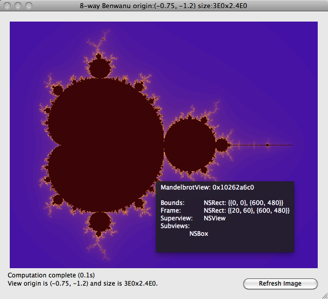

Nutron
======

An Objective-C and [Nu](http://programming.nu) runtime browser. And then some.

Introduction
------------
Nutron is a set of framework-based components that help you inspect, browse and debug your Objective-C runtime environment.

Nutron also ships with *Nutronic*. Nutronic bundles an integrated set of components together into a standalone application to be used as an enhanced Nu shell.

Components
----------
Nutron consists of several graphical components, detailed below.  Each component can be invoked as a standalone window, or can be embedded in an application.

### Nutron Console

The Nutron Console is similar to the Nu Console, but is designed for being embedded in other components or applications. The Nutron Console can call back to an option delegate after each command is evaluated.

The Nutron Console can be invoked as a standalone window from an existing Nu or Nutron console like this:

	(Nutron console)

### Nutron Object Inspector

### Nutron Class Viewer

### Nutron View Selector

Sometimes you want to inspect a visual object, but it is not easily available through a variable in the console. You can sometimes walk a clever object hierarchy to get to it:

	(((((NSApplication sharedApplication) mainWindow) contentView) subviews) 0)
	
It's much easier to just use the mouse to select the view that you want to work with.  Nutron's `selectView` method turns your cursor into a crosshair and will highlight view objects in your application as you mouse over them.

When the view you are interested in is highlighted, click the mouse button and that NSView-based object will be the return value of `selectView`, which you can assign to a variable.

	(set mv (Nutron selectView))
	
Alternatively, you can also directly inspect the return value of `selectView`:

	(inspect (Nutron selectView))
	
This will launch Nutron's Object Inspector with the view that you selected:

### Nutron

The Nutron component wires together a console, object inspector and class viewer to provide an integrated debugging and browsing tool.

The object viewer shows the Nu parser context, which consists of all locally defined objects (plus two objects internal to the workings of Nu: `_parser` and `symbols`). The object viewer is refreshed after the Nutron console evaluates a command.

By default, a new parser context is created for the Nutron Console. For an applications written in Nu (like Benwanu), you might prefer to see the context of the parser that evaluated the code of the application. You can pass in an existing parser object to Nutron and it will operate in that parser's context:

You can invoke Nutron with an existing parser with the `nutronWithParser` method:

	(Nutron nutronWithParser:_parser)

This also allows you to share a single parser and context among multiple instances of Nutron consoles and object viewers.

If you select an Objective-C object in the object viewer, the class definition is shown in the class viewer.

Standalone Application
----------------------
Nutronic is a standalone application that glues the various Nutron components together to provide a Nu development shell.

Bugs and Limitations
--------------------
- Nutron can crash the hosting application if it tries to display details of a deallocated object. Better signal handling is planned for the future.

- Nutron currently does not parse or interpret C structs, but support for some well-known structs (such as `NSRect`, `NSPoint`, etc.) is planned.

- Nutron currently does not expand the methods and properties that are part of a protocol.

- Other known bugs and planned features are listed in the [Issues](http://github.com/itfrombit/nutron/issues) page of the [github repository](http://github.com/itfrombit/nutron).

Acknowledgements
----------------
- Nutron's select-view function uses a slightly modified version of the view selector code in F-Script.  F-Script is written by Philippe Mougin and can be found at [http://www.fscript.org](http://www.fscript.org).

- The Nutron Console is adapted from the NuConsole code that ships with Nu.

Author
------
Nutron was written by Jeff Buck.

&copy; 2010 Jeff Buck

