What is Nutron?
===============

Nutron is a framework of user interface components that help you inspect, browse and debug your Objective-C and Nu runtime environments.  Nutron uses Nu as its scripting language.

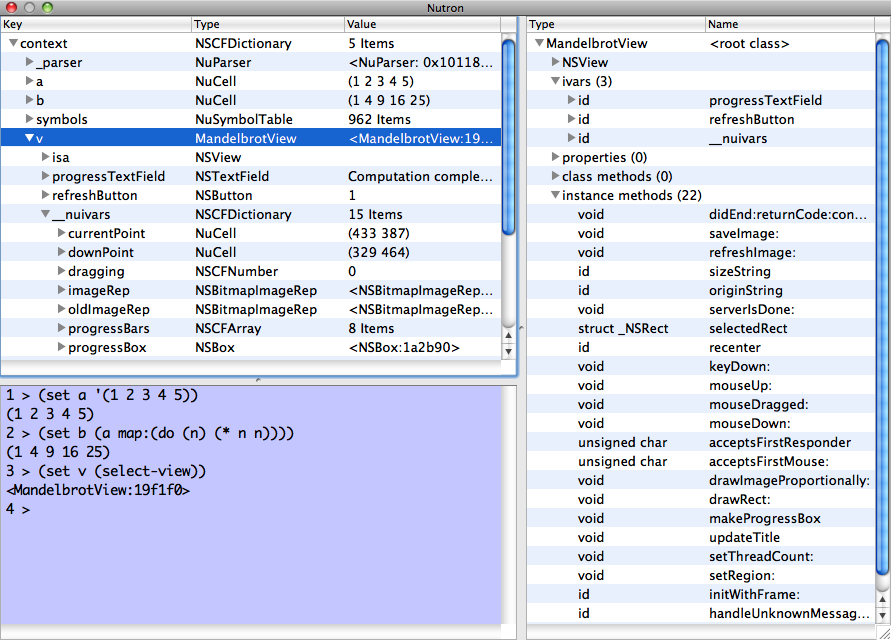

Nutron also comes with an application named *Nutronic*. Nutronic bundles an integrated set of Nutron components together into a standalone application that can be used as an enhanced Nu shell.

Components
==========

Nutron consists of four core components:
1. An object inspector
2. An enhanced Nu console
3. A class viewer
4. A view selector

Each component can be invoked as a standalone window, or can be embedded as part of another application or framework.  

Nutron Object Inspector
-----------------------

The Nutron Object Inspector shows the internals of Objective-C objects.  Any valid Objective-C object or Nu expression that returns a value can be passed to the object inspector:

	(set viewInspector (nutron-inspect mandelbrotView))

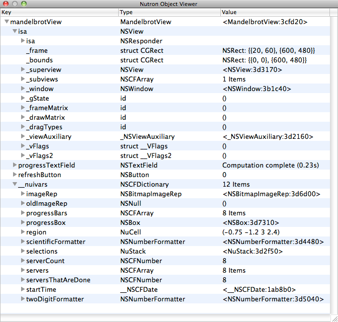

The inspector shows a view similar to what you might see in a debugger.  All instance variable values of an object are shown.  A special `isa` variable is also shown for any expanded Objective-C objects.  Expanding this variable will show the instance variables that belong to the object's superclass.  You can continue to expand this hierarchy until you reach the top-level base class (usually `NSObject`).

Note: instance variables that are C structs or unions are shown in the Type column, but they are not yet expandable and the Value column does not currently show correct values.  However, Nutron does support `CGRect`, `CGPoint`, and `CGSize` structures.

If you launched the object inspector from a Nutron console (like in the above code snippet), you can refresh the values of the object tree to view any changes in state:

	(viewInspector refresh)

### Special Object Expansion

The object inspector is aware of several types of Objective-C and Nu objects:
- NSDictionary
- NSArray
- NuSymbolTable

Expanding an object of one the above types will not show the object's instance variables.  Instead, a (hopefully) more useful expansion is performed for each type, which results in a compact display of the object's state.

For example, inspecting an NSDictionary shows an alphabetized list of keys, types, and values:

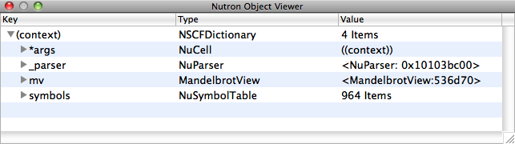

`(context)` is a dictionary of all defined objects in the current Nu parser's evaluation context.  You can see the top-level description for the dictionary shows the number of key/value pairs in the dictionary instead of the pointer value of the dictionary object.  Each child of the dictionary root item is one of the key/value pairs.

Nutron Console
--------------

The Nutron Console is similar to the console that ships with Nu, but the Nutron version is designed for participating with other components of an application.  Specifically, the Nutron Console can be sent input from a external source and can also call back to an optional delegate after each command is evaluated.

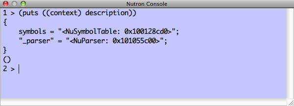

The Nutron Console can be invoked as a standalone window from an existing Nu or Nutron console:

	(set nc (Nutron console))

Nutron Class Viewer
-------------------

The Nutron class viewer shows the definition of an Objective-C class.  You can view the class definition in one of two ways:
1. As an Objective-C class definition like you would see in a header file.
2. As an expandable outline view.

The class definition view looks like an Objective-C declaration:

	(Nutron viewClass:"MandelbrotView")
	
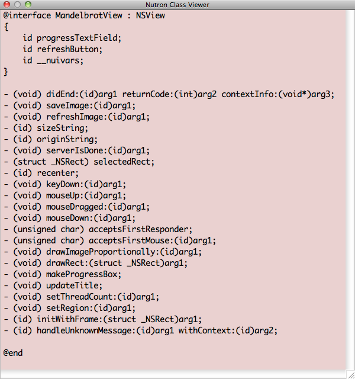

The main advantage of using the outline view mode to view a class definition is that you can drill down into the definition of the class' superclasses.

	(Nutron outlineClass:"MandelbrotView")
	
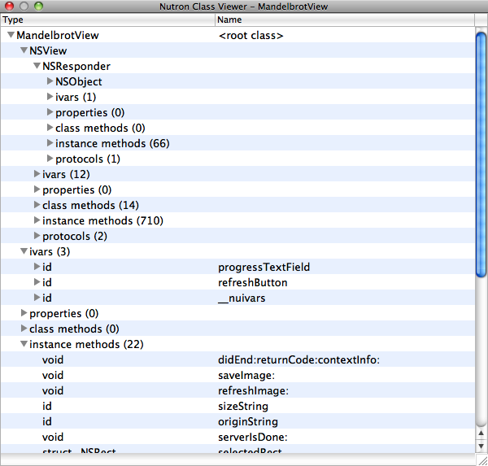

Nutron View Selector
--------------------

*Note: The View Selector code is adapted from [F-Script](http://www.fscript.org).  See the acknowledgments section below.*

Sometimes you want to inspect a visual object that is not easily available through a variable at the console. You can sometimes walk a clever object hierarchy to get to a particular view:

	(set mv (((((NSApplication sharedApplication) mainWindow) contentView) subviews) 0))
	
But it is usually much easier to just use the mouse to select the view that you want to work with.  Nutron's `selectView` method turns your cursor into a crosshair and will highlight view objects in your application as you mouse over them.

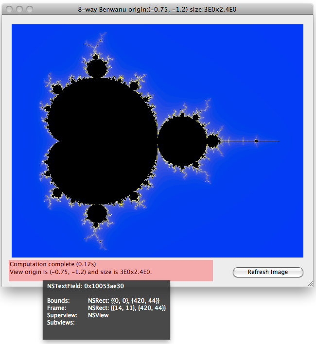

When the view you are interested in is highlighted, click the mouse button and the highlighted view will be the return value of `selectView`, which you can assign to a variable.

	(set mv (Nutron selectView))
	
Alternatively, you can also directly inspect the return value of `selectView`:

	(set mv (inspect (Nutron selectView)))
	
This will launch Nutron's Object Inspector with the view that you selected:

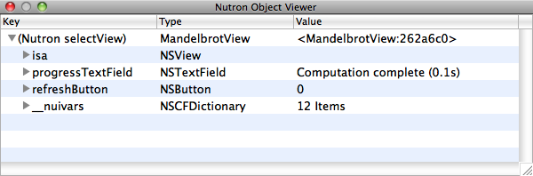

If you call the `selectView` method and want to cancel view selection, hit the Escape key.  The `selectView` method will return nil.

Nutron
------

In addition to being the name of the framework, Nutron is also the name of the main component that wires together a console, object inspector and class viewer to provide an integrated debugging and browsing tool.

	(set n (Nutron nutron))

The object viewer shows the current Nu parser context, which consists of all locally defined objects (plus two objects internal to the workings of Nu: `_parser` and `symbols`). The object viewer is refreshed each time the Nutron console evaluates a command.

By default, a new parser context is created for the Nutron Console. For applications written in Nu (like the Benwanu sample application we've been looking at), you might prefer to see the context of the parser that evaluated the code of the application. You can pass in an existing parser object to Nutron using the `nutronWithParser:` method and it will operate in that parser's context:

	(set np (Nutron nutronWithParser:_parser))

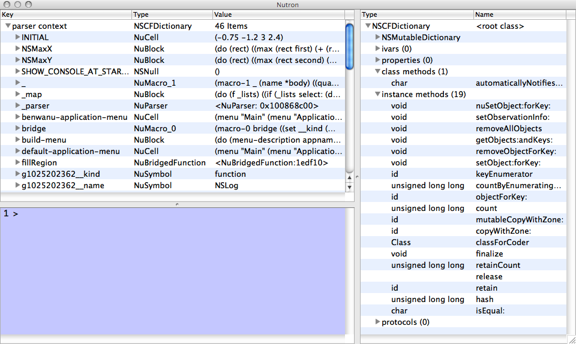

This also provides you the option of sharing a single parser and context among multiple instances of Nutron consoles and object viewers.

If you select an Objective-C object in the object viewer, the corresponding class definition is shown in the class viewer.

Nutronic
========

The Nutronic application provides a standalone executable that wraps the above Nutron component and can be used for general Nu programming.  Nutronic doesn't yet support opening files from the File menu, but you can load a file via the Nutron Console as you would in `nush`.

	(load "~/dev/nu/callcc/callcc.nu")
	
When you load a file, all symbols defined in that file will show up in the object browser.

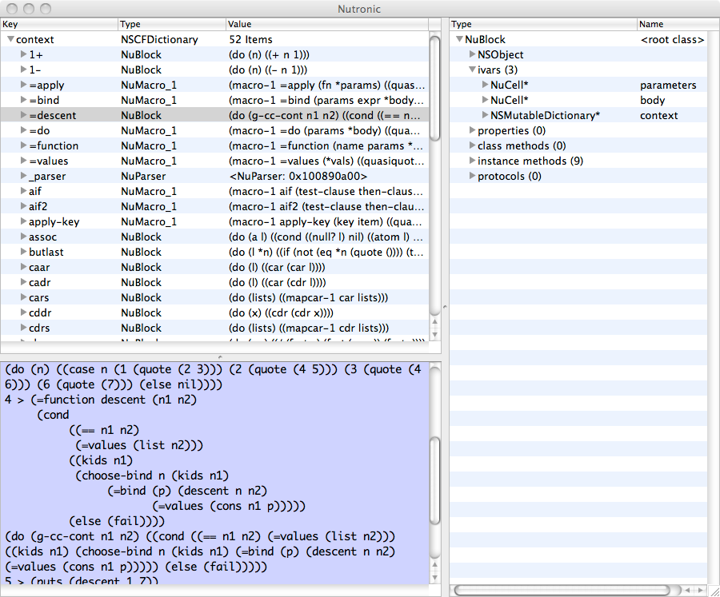

Installation
============

The Nutron repository is at [http://github.com/itfrombit/nutron](http://github.com/itfrombit/nutron).

Nutron depends on [Nu](http://programming.nu).  The Nu repository is at [http://github.com/timburks/nu](http://github.com/timburks/nu).  You need a version of Nu that is from 2010-10-02 or later.

The quickest way to build and install the Nutron framework is to use nuke:

	nuke
	nuke install
	
The Nukefile builds a universal binary that supports both `i386` and `x86_64` architectures.

Nutron also comes with an Xcode project for developing and debugging the Nutron framework.

An Xcode project for building Nutronic is in the `Nutronic` subdirectory of the root Nutron folder.  The Nukefile does not build Nutronic.

Command Summary
===============

The Objective-C interface to Nutron's functions is through a set of class methods in the `Nutron` class:

	// The Nutron console
	+ (NutronConsoleWindowController*)console;
	
	// The Object Inspector. Pass in an object to inspect and a description.
	+ (NutronObjectViewWindowController*)inspect:(id)object withName:(NSString*)name;
	
	// The class viewer. Shows the Objective-C interface definition of the class.
	+ (NutronClassTextViewWindowController*)viewClass:(NSString*)className;
	
	// The class outline viewer. Shows the class definition in an outline view.
	+ (NutronClassOutlineViewWindowController*)outlineClass:(NSString*)className;

	// The graphical view selector
	+ (id)selectView;

	// The integrated environment pane
	+ (NutronWindowController*)nutron;

	// Alternate ways of launching a Nutron instance:
	// Instead of browsing the current context, browse `object` as the root item.
	+ (NutronWindowController*)nutronWithObject:(id)object andName:(NSString*)name;
	
	// Instead of creating a new parser context, use an existing one.
	+ (NutronWindowController*)nutronWithParser:(id)parser;

While the above functions can be called from a Nu or Nutron console, a set of Nu convenience functions is also provided:

	(nutron-console)
	(nutron-inspect someObject)
	(nutron-view-class "NSString")
	(nutron-outline-class "NSString")
	(nutron-select-view)
	(nutron)                            ;; the integrated console/browser/class viewer
	(nutron-with-parser _parser)        ;; using an existing parser

Note that each method above returns an instance of a Nutron object.  If you are calling one of the functions from Objective-C, you should retain the object.  If you are calling one of the functions from Nu, you should set the return value to a variable.

The most recent `NutronWindowController` instance is kept in the special `$$nutron` Nu global variable.  If you have changed the state of your application outside of Nutron, you can use the `refresh` method to update the values in the object inspector:

	($$nutron refresh)
	
The object inspector (the `NutronObjectViewWindowController` class) also supports a `refresh` method.

Embedding Nutron in Objective-C
===============================

If you want to embed Nutron in your Objective-C application:

1. Link with the Nu and Nutron frameworks.

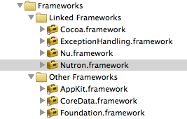
2. Add an instance variable of type `NutronWindowController*` to your AppDelegate class (or something similar).
3. In your AppDelegate's `applicationDidFinishLaunching:` method, add 

	`nutron = [[Nutron nutron] retain]; // nutron is the name of your instance variable`
	
4. In your AppDelegate's `dealloc` method, `release` the `NutronWindowController*` instance variable.

Using Nutron from Nu
====================

To use any of the Nutron components from a Nu console, load the Nutron framework:

	(load "Nutron")
	
You can then either call the `Nutron` class methods, or use the Nu convenience functions described above.

Note that Nutron does not work from the `nush` command line.  Nutronic provides a standalone environment for using the Nutron components.

Bugs and Limitations
====================

Nutron can crash the hosting application if it tries to display details of a deallocated object!  You are playing with a live runtime, so be careful.  Some better signal handling is in the works to handle this condition, but caveat programmer.

Nutron does not currently remember the state of expansion of the object inspector outline view when refreshed.  This is at the top of the planned features list.

Nutron currently does not parse or interpret C structs, but some well-known structs (such as `CGRect`, `CGPoint`, `CGSize`) are supported.

Other known bugs and planned features are listed in the [Issues](http://github.com/itfrombit/nutron/issues) page of the [github repository](http://github.com/itfrombit/nutron).

Acknowledgements
================
- Nutron's select-view function uses a modified version of the view selector code from F-Script.  F-Script is a great set of developer tools that provides interactive introspection, manipulation and scripting of Cocoa objects.  F-Script is written by Philippe Mougin and can be found at [http://www.fscript.org](http://www.fscript.org).  A copy of F-Script's license is provided in the Nutron distribution.

- The Nutron Console is adapted from the NuConsole code that ships with Nu.

Author
======
Nutron was written by Jeff Buck.

